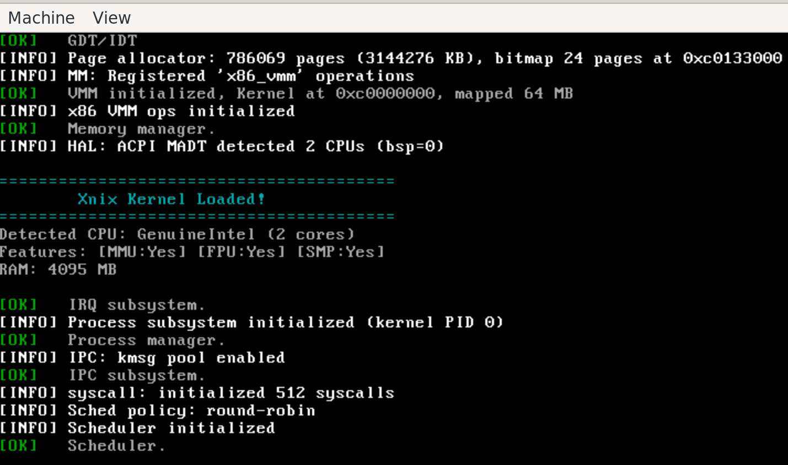
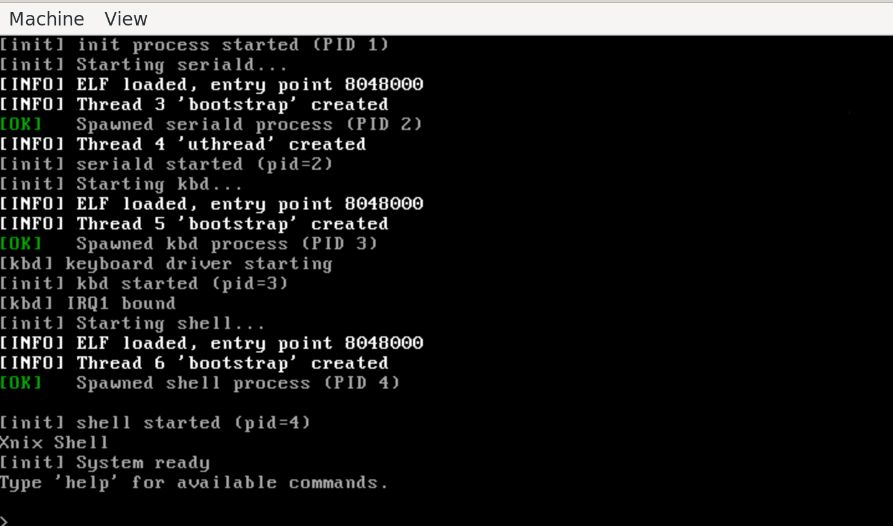
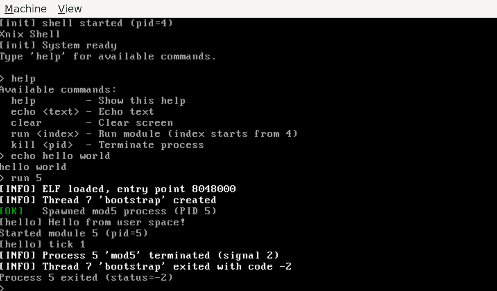
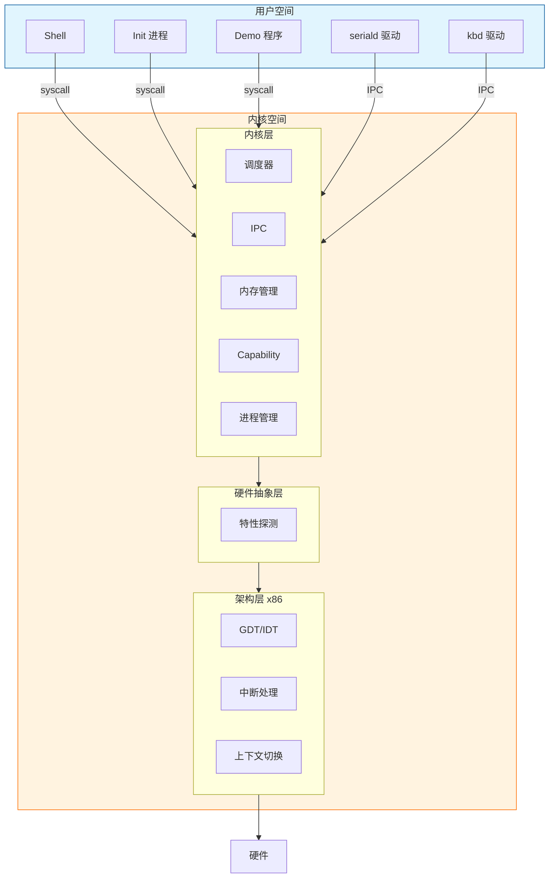
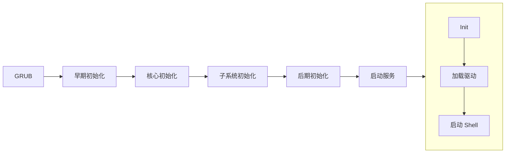
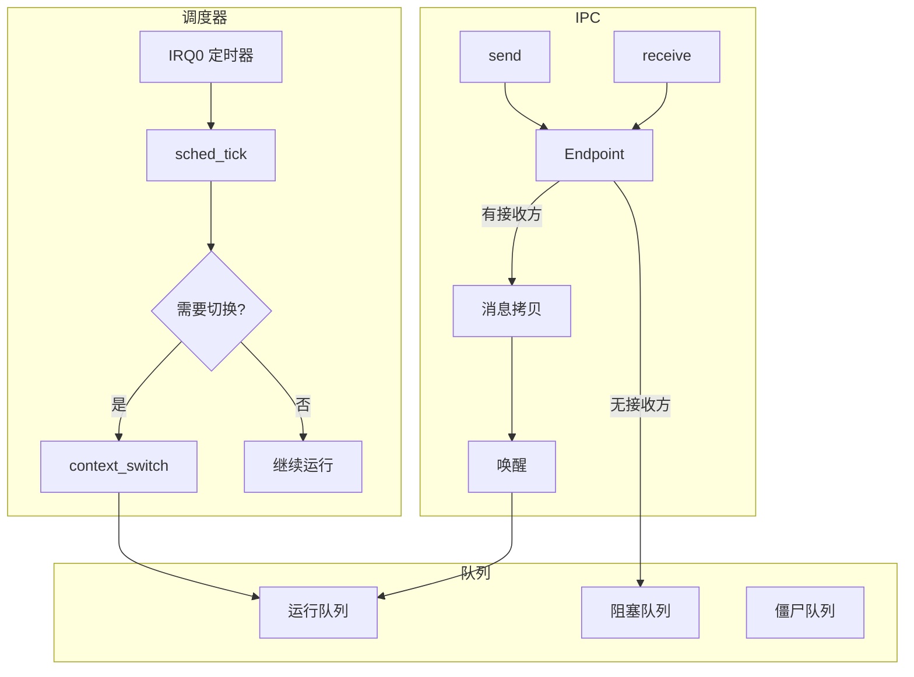
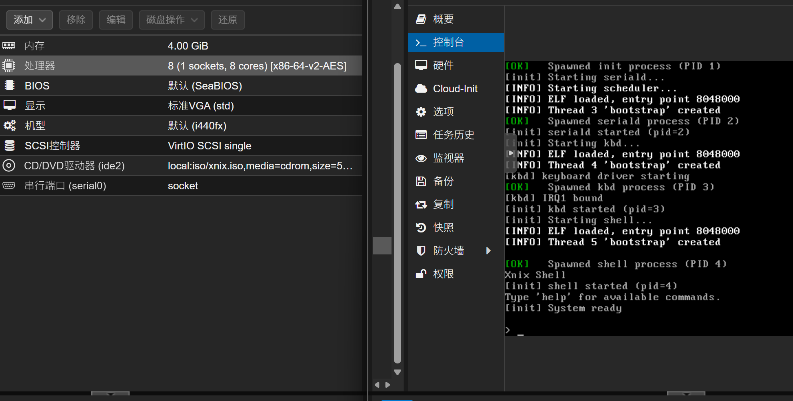

# Xnix

一个用于学习操作系统原理的 x86 微内核操作系统。



## 简介

Xnix 是一个从零构建的 32 位 x86 操作系统内核，采用微内核架构设计。项目源于作者在完成
MyRTOS-Demo（[GitHub](https://github.com/SH-XiaoXiu/MyRTOS-Demo) / [Gitee](https://gitee.com/sh-xiaoxiu/my-rtos-demo)
）（ARM32 RTOS）后，希望进一步探索更复杂的系统设计。

**技术栈**：C11 + x86 Assembly + CMake + GCC + QEMU

## 核心能力

| 能力                | 说明                  | 示例                      |
|-------------------|---------------------|-------------------------|
| 微内核设计             | 最小化内核，策略与机制分离       | 内核仅含调度、IPC、内存管理         |
| 平台抽象              | HAL + 弱符号机制，支持多平台移植 | 新增架构只需实现少量强符号           |
| 能力系统 (Capability) | 细粒度权限控制，无全局特权       | I/O 端口访问需持有对应 cap       |
| IPC 通信            | 同步/异步消息传递，支持 RPC 模式 | endpoint send/recv/call |
| 用户态驱动 (UDM)       | 驱动隔离，崩溃可恢复，支持热更新    | seriald、kbd 均为用户进程      |
| 进程管理              | 完整生命周期、信号机制、进程树     | fork-like spawn、SIGTERM |
| FAT32 文件系统        | 支持读写 FAT32 格式磁盘     | 可挂载硬盘镜像进行文件操作           |
| 声明式服务管理           | INI 配置、依赖管理、自动重启    | services.conf 定义启动顺序    |

## 项目亮点

- **平台无关设计**：内核核心逻辑与硬件分离，通过 HAL 抽象层适配不同平台
- **弱符号机制**：使用 `__attribute__((weak))` 实现优雅的平台适配
- **Opaque 类型**：公共 API 隐藏内部实现，保证接口稳定性
- **驱动隔离**：UDM 模式下驱动崩溃可自动恢复，不拖垮系统
- **FAT32 支持**：可读写 FAT32 磁盘镜像，方便与宿主机交换文件

## 快速开始

### 1. 环境准备

**Windows 用户**

需要先安装 WSL2，参考 [微软官方文档](https://learn.microsoft.com/zh-cn/windows/wsl/install)，然后在 WSL 中按 Linux
方式安装工具链。

**Linux 用户 (Ubuntu/Debian)**

```bash
sudo apt install gcc gcc-multilib grub-pc-bin xorriso qemu-system-x86 make cmake
```

### 2. 构建并运行

```bash
git clone https://github.com/user/xnix.git
cd xnix
./run -b -i    # 清理重建 + ISO 模式运行
```



### 3. 体验 Shell

系统启动后会进入交互式 shell，可以尝试：

```
> help           # 查看可用命令
> ps             # 查看进程列表
> demo hello     # 运行 demo 程序
> kill <pid>     # 终止进程
```



## 运行环境

| 项目   | 要求                            |
|------|-------------------------------|
| 操作系统 | Linux（推荐 Ubuntu 20.04+）或 WSL2 |
| 编译器  | GCC 支持 32 位编译（gcc-multilib）   |
| 模拟器  | QEMU x86                      |
| 构建工具 | CMake 3.10+, Make             |

## 配置选项

通过 CMake 变量控制编译选项（在 build 目录中）：

```bash
cd build
cmake .. -DENABLE_SMP=ON -DCFG_MAX_CPUS=4    # 启用多核支持
cmake .. -DCFG_DEBUG=ON                       # 启用调试输出
```

QEMU 硬件配置：

```bash
./run -i --qemu "-m 256M -smp 4"    # 指定内存和 CPU 核心数
```

## 使用方式

### 常用命令

```bash
./run                    # 增量编译 + 运行
./run -b                 # 清理重建 + 运行
./run -i                 # ISO 模式运行
./run -b -i              # 清理重建 + ISO 模式
./run -n -b -i           # 只编译 ISO（不运行）
./run -d -i              # ISO 调试模式（GDB :1234）
./run --install src.img --hda dst.img  # 复制磁盘镜像后运行
```

### 调试

```bash
# 终端 1: 启动调试模式
./run -d -i

# 终端 2: 连接 GDB
gdb build/xnix.elf -ex "target remote :1234"
```

## 项目结构

```
xnix/
├── main/                   # 内核代码
│   ├── arch/x86/           # x86 架构实现
│   │   ├── boot/           # 启动代码、链接脚本
│   │   ├── cpu/            # GDT、IDT、上下文切换
│   │   └── hal/            # 硬件特性探测
│   ├── kernel/             # 内核子系统（平台无关）
│   │   ├── sched/          # 调度器
│   │   ├── ipc/            # IPC 机制
│   │   ├── mm/             # 内存管理
│   │   ├── process/        # 进程管理
│   │   └── cap/            # Capability 系统
│   ├── lib/                # 内核库（同步原语等）
│   ├── drivers/            # 内核态控制台（早期输出）
│   └── include/            # 公共头文件
│
├── user/                   # 用户态代码
│   ├── init/               # init 进程（服务管理）
│   ├── apps/               # 应用程序
│   │   ├── shell/          # 交互式 shell
│   │   └── bin/            # 独立工具程序
│   ├── drivers/            # UDM 驱动（seriald, kbd, fatfsd...）
│   ├── demos/              # 示例程序
│   └── libs/               # 用户态库
│
├── iso/                    # ISO 打包模块
│   ├── CMakeLists.txt      # ISO 构建配置
│   └── generate_rootfs.cmake
│
├── run                     # 构建运行脚本
├── release.sh              # 发布版本构建脚本
└── CMakeLists.txt
```

## 系统架构

### 整体架构



### 启动流程



### 调度与 IPC



## 服务配置

Xnix 采用声明式服务配置，分为核心服务和用户服务两类。

### 核心服务 vs 用户服务

| 类型   | 配置              | 加载方式            | 存放位置              |
|------|-----------------|-----------------|-------------------|
| 核心服务 | `core=true`     | Multiboot 模块启动  | ISO 根目录           |
| 用户服务 | `core=false`/默认 | 从 rootfs.img 加载 | `build/optional/` |

### 驱动/应用的 service.conf

每个驱动或应用目录下可包含 `service.conf` 文件：

```ini
# user/drivers/mydrv/service.conf
core = true          # 核心服务（Multiboot 模块）
after = seriald      # 启动顺序依赖
caps = my_ep:0       # Capability 传递（名称:目标槽位）
mount = /dev         # 挂载点（可选）
respawn = true       # 退出后自动重启
```

### 配置字段

| 字段        | 类型     | 说明                       |
|-----------|--------|--------------------------|
| `core`    | bool   | `true`=核心服务，`false`=用户服务 |
| `after`   | string | 启动顺序依赖，空格分隔多个服务          |
| `caps`    | string | Capability 传递（见下方格式说明）   |
| `mount`   | string | 服务提供的挂载点                 |
| `respawn` | bool   | 退出后自动重启                  |
| `path`    | string | 自定义 ELF 路径（可选）           |

### Capability 传递格式

`caps` 字段格式：`名称:目标槽位 名称:目标槽位 ...`

```ini
# 示例：传递 ata_io 到槽位 1，ata_ctrl 到槽位 2
caps = ata_io:1 ata_ctrl:2
```

- **名称**：init 持有的 capability 名称（见下表）
- **目标槽位**：传递给子进程后的 handle 编号

子进程通过槽位编号访问 capability：

```c
#define MY_EP_CAP 0   // 对应 caps = my_ep:0
sys_ipc_send(MY_EP_CAP, &msg);
```

### 生成的配置文件

CMake 构建时会自动生成：

- `build/include/module_index.h` - 模块索引定义
- `build/include/core_services.h` - 核心服务嵌入配置
- `build/generated/services.conf` - 用户服务配置

### 内置 Capability 名称

| 名称           | 槽位 | 说明                   |
|--------------|----|----------------------|
| `serial_ep`  | 0  | 串口 endpoint          |
| `vfs_ep`     | 2  | VFS endpoint         |
| `ata_io`     | 3  | ATA I/O 端口           |
| `ata_ctrl`   | 4  | ATA 控制端口             |
| `fat_vfs_ep` | 5  | FAT VFS endpoint     |
| `fb_ep`      | 6  | Framebuffer endpoint |
| `rootfs_ep`  | 7  | Rootfs endpoint      |

## 扩展开发

### 添加新驱动

1. 在 `user/drivers/` 下创建目录（如 `user/drivers/mydrv/`）
2. 创建 `main.c` 实现驱动主循环
3. 创建 `service.conf` 配置服务属性
4. 重新 cmake 即可自动发现

**目录结构：**

```
user/drivers/mydrv/
├── main.c           # 驱动实现
└── service.conf     # 服务配置
```

**service.conf 示例：**

```ini
# core=true 表示核心服务（作为 Multiboot 模块启动）
# core=false/默认 表示用户服务（从 rootfs 加载）
core = false
after = rootfsd
caps = my_ep:0
```

**驱动基本结构：**

```c
int main(void) {
    // 初始化
    while (1) {
        ipc_msg_t msg;
        ipc_receive(ep, &msg);  // 等待请求
        // 处理请求
        ipc_reply(ep, &reply);  // 回复
    }
}
```

### 添加系统调用

1. 在 `main/include/xnix/syscall_nr.h` 添加调用号
2. 在 `main/kernel/sys/syscall.c` 添加处理函数
3. 在 `user/libs/` 添加用户态封装

### 添加独立工具程序

在 `user/apps/bin/` 下创建子目录，包含 `main.c` 即可自动编译：

```
user/apps/bin/mytool/
├── main.c           # 工具实现
└── service.conf     # 可选，core=true 则打包到 rootfs
```

工具默认编译到 `build/optional/bin/`，shell 会搜索 `/sys/bin` 和 `/mnt/bin`。

### 添加 Shell 命令

修改 `user/apps/shell/main.c`，在命令表中添加新命令。

## 部署

Xnix 是一个教学项目，主要在 QEMU 中运行。如需在真实硬件上测试：

```bash
./run -n -b -i           # 生成 ISO
# 将 build/xnix.iso 写入 U 盘或用于虚拟机启动
```



> 注意：真实硬件运行未经充分测试，QEMU可能与真实硬件行为不一致。

## 磁盘镜像与 FAT32

Xnix 支持 FAT32 文件系统，可以通过硬盘镜像与宿主机交换文件。

### 创建硬盘镜像

构建时会自动创建 `build/disk.img`（FAT32 格式），也可以手动创建：

```bash
# 创建 32MB 的空白镜像
dd if=/dev/zero of=disk.img bs=1M count=32

# 格式化为 FAT32
mkfs.vfat -F 32 disk.img
```

### 在 Linux/WSL 中挂载

```bash
# 创建挂载点
sudo mkdir -p /mnt/xnix_disk

# 挂载镜像
sudo mount -o loop build/disk.img /mnt/xnix_disk

# 复制文件到镜像
sudo cp myfile.txt /mnt/xnix_disk/

# 卸载
sudo umount /mnt/xnix_disk
```

### 在 Windows 中使用 ImDisk 挂载

对于 Windows 用户，推荐使用 **ImDisk** 工具直接挂载磁盘镜像，无需进入 WSL。

#### 1. 安装 ImDisk

从官网下载安装：https://sourceforge.net/projects/imdisk-toolkit/

或使用 winget：

```powershell
winget install ImDisk.Toolkit
```

#### 2. 挂载镜像

**方式一：右键菜单**

在文件资源管理器中右键点击 `disk.img`，选择「Mount as ImDisk Virtual Disk」。

**方式二：命令行**

```powershell
# 挂载到 X: 盘
imdisk -a -f "C:\path\to\xnix\build\disk.img" -m X:

# 卸载
imdisk -d -m X:
```

**方式三：ImDisk 控制面板**

运行 `ImDiskCpl.exe`，点击「Mount new...」选择镜像文件。

#### 3. 操作文件

挂载后，镜像会显示为一个普通磁盘分区，可以直接拖放文件。

#### 4. 注意事项

- 挂载前确保 QEMU 未使用该镜像（否则可能损坏数据）
- 修改完成后务必先卸载再启动 QEMU
- ImDisk 支持读写模式，修改会直接写入镜像文件

## 常见问题

**Q: 编译报错找不到 32 位库？**

安装 multilib 支持：

```bash
sudo apt install gcc-multilib
```

**Q: QEMU 启动后黑屏？**

检查 GRUB 配置，确保 `grub-pc-bin` 和 `xorriso` 已安装。

**Q: 如何查看串口输出？**

```bash
./run --qemu "-serial file:serial.log"
cat serial.log
```

## 参考资料

- [《深入理解计算机系统》](https://book.douban.com/subject/26912767/)
- [《Linux内核设计与实现》](https://book.douban.com/subject/37875969/)
- [《x86汇编:从实模式到保护模式》](https://book.douban.com/subject/20492528/)
- [OSDev Wiki](https://wiki.osdev.org/)
- [Intel SDM](https://www.intel.com/sdm)
- [L4 微内核](https://www.l4hq.org/)
- [YatSenOS 教程](https://ysos.gzti.me/)

## License

MIT License

## 作者

[XiaoXiu](https://www.xiuxius.cn)
