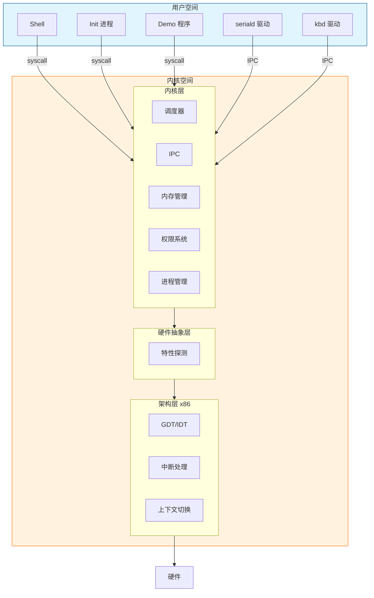
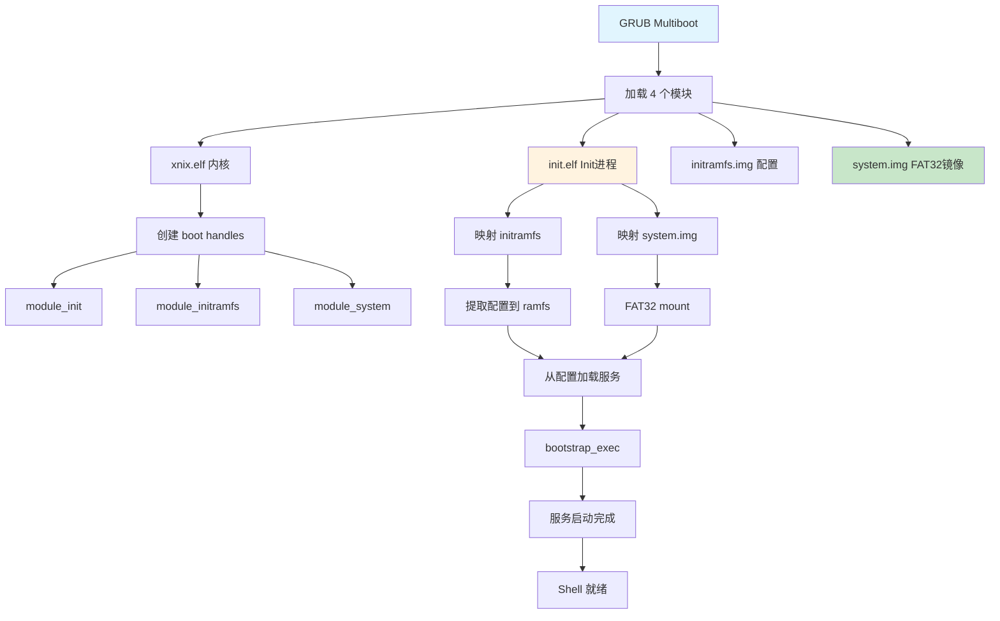
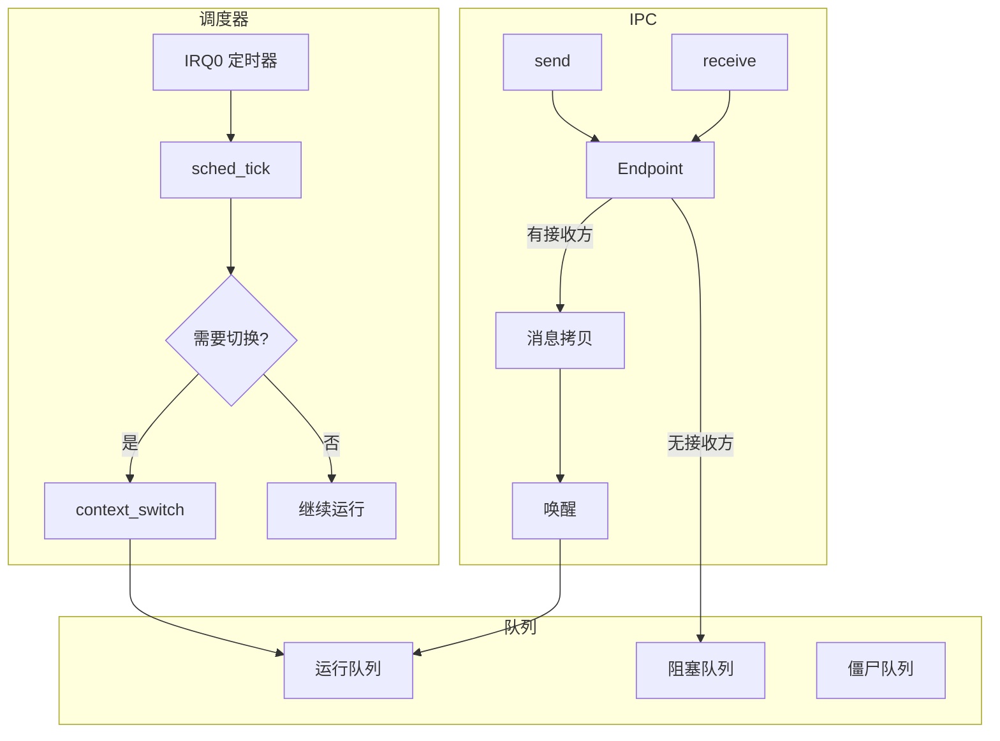

# Xnix

一个用于学习操作系统原理的 x86 微内核操作系统。


## 简介

Xnix 是一个从零构建的 32 位 x86 操作系统内核，采用微内核架构设计。项目源于作者在完成
MyRTOS-Demo（[GitHub](https://github.com/SH-XiaoXiu/MyRTOS-Demo) / [Gitee](https://gitee.com/sh-xiaoxiu/my-rtos-demo)
）（ARM32 RTOS）后，希望进一步探索更复杂的系统设计。

**技术栈**：C11 + x86 Assembly + CMake + GCC + QEMU

## 核心能力

| 能力           | 说明                         | 示例                         |
|--------------|----------------------------|----------------------------|
| 微内核设计        | 最小化内核，策略与机制分离              | 内核仅含调度、IPC、内存管理            |
| Bootstrap 自举 | Init 完全自举，内核不依赖 bootloader | 内置 FAT32 驱动，绕过 VFS 启动服务    |
| 平台抽象         | HAL + 弱符号机制，支持多平台移植        | 新增架构只需实现少量强符号              |
| 权限系统 (Perms) | 字符串节点权限，Profile 管理         | `xnix.io.port.*` 控制 I/O 访问 |
| IPC 通信       | 同步/异步消息传递，支持 RPC 模式        | endpoint send/recv/call    |
| 用户态驱动 (UDM)  | 驱动隔离，崩溃可恢复，支持热更新           | seriald、kbd 均为用户进程         |
| 进程管理         | 完整生命周期、信号机制、进程树            | exec-based spawn、SIGTERM   |
| FAT32 文件系统   | 支持读写 FAT32 格式磁盘            | 可挂载硬盘镜像进行文件操作              |
| 声明式服务管理      | INI 配置、依赖管理、自动重启           | services.conf 定义启动顺序       |

## 项目亮点

- **平台无关设计**：内核核心逻辑与硬件分离，通过 HAL 抽象层适配不同平台
- **弱符号机制**：使用 `__attribute__((weak))` 实现优雅的平台适配
- **Opaque 类型**：公共 API 隐藏内部实现，保证接口稳定性
- **驱动隔离**：UDM 模式下驱动崩溃可自动恢复，不拖垮系统
- **FAT32 支持**：可读写 FAT32 磁盘镜像，方便与宿主机交换文件

## 快速开始

### 1. 环境准备

**Windows 用户**

需要先安装 WSL2，参考 [微软官方文档](https://learn.microsoft.com/zh-cn/windows/wsl/install)，然后在 WSL 中按 Linux
方式安装工具链。

**Linux 用户 (Ubuntu/Debian)**

```bash
sudo apt install gcc gcc-multilib grub-pc-bin xorriso qemu-system-x86 make cmake
```

### 2. 构建并运行

```bash
git clone https://github.com/user/xnix.git
cd xnix
./run -b -i    # 清理重建 + ISO 模式运行
```


### 3. 体验 Shell

系统启动后会进入交互式 shell，可以尝试：

```
> help           # 查看可用命令
> ps             # 查看进程列表
> demo hello     # 运行 demo 程序
> kill <pid>     # 终止进程
```


## 运行环境

| 项目   | 要求                            |
|------|-------------------------------|
| 操作系统 | Linux（推荐 Ubuntu 20.04+）或 WSL2 |
| 编译器  | GCC 支持 32 位编译（gcc-multilib）   |
| 模拟器  | QEMU x86                      |
| 构建工具 | CMake 3.10+, Make             |

## Bootstrap 启动

Xnix 实现了微内核自举架构，内核不依赖 bootloader 细节：

### 设计原则

| 组件       | 职责                | 不知道什么             |
|----------|-------------------|-------------------|
| **内核**   | 提供机制（进程创建、IPC、内存） | 不知道 GRUB、不知道文件系统  |
| **Init** | 策略实现（服务启动、配置管理）   | 完全自举，不依赖外部服务      |
| **服务**   | 功能实现（VFS、驱动等）     | 从 system.img 按需加载 |

## 配置选项

通过 CMake 变量控制编译选项（在 build 目录中）：

```bash
cd build
cmake .. -DENABLE_SMP=ON -DCFG_MAX_CPUS=4    # 启用多核支持
cmake .. -DCFG_DEBUG=ON                       # 启用调试输出
```

QEMU 硬件配置：

```bash
./run -i --qemu "-m 256M -smp 4"    # 指定内存和 CPU 核心数
```

## 使用方式

### 常用命令

```bash
./run                    # 增量编译 + 运行
./run -b                 # 清理重建 + 运行
./run -i                 # ISO 模式运行
./run -b -i              # 清理重建 + ISO 模式
./run -n -b -i           # 只编译 ISO（不运行）
./run -d -i              # ISO 调试模式（GDB :1234）
./run --install src.img --hda dst.img  # 复制磁盘镜像后运行
```

### 调试

```bash
# 终端 1: 启动调试模式
./run -d -i

# 终端 2: 连接 GDB
gdb build/xnix.elf -ex "target remote :1234"
```

## 项目结构

```
xnix/
├── main/                   # 内核代码
│   ├── arch/x86/           # x86 架构实现
│   │   ├── boot/           # 启动代码、链接脚本
│   │   ├── cpu/            # GDT、IDT、上下文切换
│   │   └── hal/            # 硬件特性探测
│   ├── kernel/             # 内核子系统（平台无关）
│   │   ├── sched/          # 调度器
│   │   ├── ipc/            # IPC 机制
│   │   ├── mm/             # 内存管理
│   │   ├── process/        # 进程管理
│   │   ├── perm/           # 权限系统
│   │   └── handle/         # 句柄系统
│   ├── lib/                # 内核库（同步原语等）
│   ├── drivers/            # 内核态控制台（早期输出）
│   └── include/            # 公共头文件
│
├── sdk/                    # 公共 ABI 层
│   ├── include/xnix/abi/   # 稳定 ABI 接口（syscall, ipc, handle）
│   └── include/xnix/driver/# 驱动辅助工具（ioport, irq）
│
├── user/                   # 用户态代码
│   ├── init/               # Init 进程（服务管理 + 自举）
│   │   ├── bootstrap/      # FAT32 reader + exec wrapper
│   │   ├── svc/            # 服务管理器
│   │   ├── ramfs.c         # 内置 ramfsd
│   │   └── core_services.conf  # 核心服务配置
│   ├── apps/               # 应用程序
│   │   ├── shell/          # 交互式 shell
│   │   └── bin/            # 独立工具程序
│   ├── drivers/            # UDM 驱动（seriald, kbd, fatfsd...）
│   ├── servers/            # 系统服务（vfsserver 等）
│   ├── demos/              # 示例程序
│   └── libs/               # 用户态库（libc, libvfs, libpthread）
│
├── iso/                    # ISO 打包模块
│   ├── CMakeLists.txt      # 生成 initramfs.img + system.img
│   └── create_initramfs.sh # TAR 打包脚本
│
├── scripts/
│   └── build_system_img.sh# FAT32 镜像生成
│
├── run                     # 构建运行脚本
├── release.sh              # 发布版本构建脚本
└── CMakeLists.txt
```

## 系统架构

### 整体架构



### 启动流程



### 调度与 IPC



## 服务配置

Xnix 采用声明式服务配置，所有服务从 **system.img**（FAT32 格式）加载。

### ISO 结构

```
xnix.iso
├── boot/
│   ├── xnix.elf         # 内核
│   ├── init.elf         # Init 进程（内置 ramfsd + bootstrap）
│   ├── initramfs.img    # TAR 格式配置文件（~5KB）
│   └── system.img       # FAT32 镜像（所有服务，16MB）
└── ...
```

### system.img 内容

```
system.img (FAT32):
├── sbin/                # 核心服务
│   ├── seriald.elf
│   ├── kbd.elf
│   ├── vfsserver.elf
│   └── ...
├── bin/                 # 应用程序
│   └── shell.elf
├── etc/                 # 配置文件
│   └── core_services.conf
└── drivers/             # 可选驱动
```

### 服务配置文件

核心服务配置在 `user/init/core_services.conf`，使用 INI 格式：

```ini
# 服务定义
[service.seriald]
builtin = true       # 内置服务标记
type = path          # 加载类型（path=从文件系统）
path = /sbin/seriald.elf   # ELF 文件路径（相对 system.img）
profile = io_driver  # 权限 Profile
after = ramfsd       # 启动顺序依赖
provides = serial    # 提供的 handle
respawn = false      # 退出后是否重启
```

### 配置字段

| 字段         | 类型     | 说明                                            |
|------------|--------|-----------------------------------------------|
| `builtin`  | bool   | 标记为内置服务（由 init 硬编码启动）                         |
| `type`     | string | `path`=从文件系统加载（system.img）                    |
| `path`     | string | ELF 文件路径（相对 system.img 根目录，如 `/sbin/xxx.elf`） |
| `profile`  | string | 权限配置 Profile (如 `io_driver`, `default`)       |
| `after`    | string | 启动顺序依赖，空格分隔多个服务                               |
| `ready`    | string | 就绪等待依赖，等待服务报告就绪                               |
| `provides` | string | 提供的 handle 名称                                 |
| `requires` | string | 需要的 handle，空格分隔                               |
| `respawn`  | bool   | 退出后自动重启                                       |

### Handle 机制

服务可以通过 `provides` 和 `requires` 声明 handle 依赖：

```ini
[service.vfsserver]
provides = vfs_ep      # 创建名为 vfs_ep 的 endpoint

[service.shell]
requires = vfs_ep      # 接收 vfs_ep handle
```

服务内部通过名称查找 handle：

```c
handle_t vfs = sys_handle_find("vfs_ep");
ipc_send(vfs, &msg);
```

### 构建时生成

CMake 构建时自动生成：

- `build/system.img` - FAT32 镜像，包含所有服务 ELF
- `build/initramfs.img` - TAR 镜像，包含配置文件
- `build/generated/services.conf` - 合并后的服务配置

## 构建规范

### 如果基于 Xnix 开发

遵循以下规范可让 CMake 自动发现并构建你的组件：

#### 1. 添加驱动/服务

在 `user/drivers/` 或 `user/servers/` 创建目录：

```
user/drivers/mydrv/
├── src/
│   └── main.c       # 驱动实现
└── CMakeLists.txt   # 构建配置
```

**CMakeLists.txt 最小示例：**

```cmake
add_executable(mydrv.elf src/main.c)
target_link_libraries(mydrv.elf PRIVATE c d)
target_link_options(mydrv.elf PRIVATE ${USER_LINK_OPTIONS})
```

**在 core_services.conf 中声明：**

```ini
[service.mydrv]
builtin = true
type = path
path = /sbin/mydrv.elf
profile = io_driver
```

#### 2. 添加应用程序

在 `user/apps/` 创建目录：

```
user/apps/myapp/
├── main.c
└── CMakeLists.txt
```

**CMakeLists.txt：**

```cmake
add_executable(myapp.elf main.c)
target_link_libraries(myapp.elf PRIVATE c vfs)
target_link_options(myapp.elf PRIVATE ${USER_LINK_OPTIONS})
```

应用会自动打包到 `system.img:/bin/myapp.elf`。

#### 3. 头文件包含规范

| 路径前缀                | 可见性   | 说明         |
|---------------------|-------|------------|
| `<xnix/abi/xxx>`    | 公共ABI | 用户态/内核共享接口 |
| `<xnix/driver/xxx>` | 公共SDK | 驱动辅助工具     |
| `<libs/xxx/xxx.h>`  | 服务SDK | 服务客户端库     |
| `<xnix/xxx>`        | 内核内部  | 仅内核可用      |

**用户态代码只能包含：**

```c
#include <xnix/abi/syscall.h>    // ✓ ABI
#include <xnix/driver/ioport.h>  // ✓ 驱动工具
#include <libs/serial/serial.h>  // ✓ 服务 SDK
#include <stdio.h>               // ✓ libc

#include <xnix/ipc.h>            // ✗ 内核内部
```

#### 4. 权限 Profile

在 `main/kernel/perm/profile.c` 定义 Profile：

```c
static const struct perm_profile profiles[] = {
    {
        .name = "my_driver",
        .nodes = {
            "xnix.irq.5",
            "xnix.io.port.0x300-0x3ff",
            NULL
        }
    }
};
```

### 如果不基于 Xnix

你可以自由组织代码结构，只需确保：

1. **ABI 兼容**：包含 `sdk/include/xnix/abi/` 头文件
2. **启动约定**：实现 `_start` 或使用 `sdk/lib/crt0.S`
3. **系统调用**：通过 `int 0x80` 调用内核

**最小用户程序：**

```c
#include <xnix/abi/syscall.h>

void _start(void) {
    asm volatile("mov $305, %eax; mov $0, %ebx; int $0x80");
    __builtin_unreachable();
}
```

**构建：**

```bash
gcc -m32 -nostdlib -T custom.ld myapp.c -o myapp.elf
```

### 添加系统调用

1. **定义系统调用号**（`sdk/include/xnix/abi/syscall.h`）：
   ```c
   #define SYS_MYNEWCALL 700
   ```

2. **实现内核处理**（`main/kernel/sys/sys_xxx.c`）：
   ```c
   static int32_t sys_mynewcall(const uint32_t *args) {
       // 实现逻辑
       return 0;
   }

   void sys_xxx_init(void) {
       syscall_register(SYS_MYNEWCALL, sys_mynewcall, 1, "mynewcall");
   }
   ```

3. **用户态封装**（`user/libs/libc/include/xnix/syscall.h`）：
   ```c
   static inline int sys_mynewcall(int arg) {
       return syscall1(SYS_MYNEWCALL, arg);
   }
   ```

### 调试技巧

#### 内核调试

```bash
# 终端 1
./run -d -i

# 终端 2
gdb build/xnix.elf
(gdb) target remote :1234
(gdb) b kernel_main
(gdb) c
```

#### 用户态调试

在代码中使用 `kprintf`（通过串口输出）：

```c
#include <xnix/ulog.h>

ulog_info("mydrv", "Initialized, handle=%d", ep);
```

## 部署

Xnix 是一个教学项目，主要在 QEMU 中运行。如需在真实硬件上测试：

```bash
./run -n -b -i           # 生成 ISO
# 将 build/xnix.iso 写入 U 盘或用于虚拟机启动
```


> 注意：真实硬件运行未经充分测试，QEMU可能与真实硬件行为不一致。

## 磁盘镜像与 FAT32

Xnix 支持 FAT32 文件系统，可以通过硬盘镜像与宿主机交换文件。

### 创建硬盘镜像

构建时会自动创建 `build/disk.img`（FAT32 格式），也可以手动创建：

```bash
# 创建 32MB 的空白镜像
dd if=/dev/zero of=disk.img bs=1M count=32

# 格式化为 FAT32
mkfs.vfat -F 32 disk.img
```

### 在 Linux/WSL 中挂载

```bash
# 创建挂载点
sudo mkdir -p /mnt/xnix_disk

# 挂载镜像
sudo mount -o loop build/disk.img /mnt/xnix_disk

# 复制文件到镜像
sudo cp myfile.txt /mnt/xnix_disk/

# 卸载
sudo umount /mnt/xnix_disk
```

### 在 Windows 中使用 ImDisk 挂载

对于 Windows 用户，推荐使用 **ImDisk** 工具直接挂载磁盘镜像，无需进入 WSL。

#### 1. 安装 ImDisk

从官网下载安装：https://sourceforge.net/projects/imdisk-toolkit/

或使用 winget：

```powershell
winget install ImDisk.Toolkit
```

#### 2. 挂载镜像

**方式一：右键菜单**

在文件资源管理器中右键点击 `disk.img`，选择「Mount as ImDisk Virtual Disk」。

**方式二：命令行**

```powershell
# 挂载到 X: 盘
imdisk -a -f "C:\path\to\xnix\build\disk.img" -m X:

# 卸载
imdisk -d -m X:
```

**方式三：ImDisk 控制面板**

运行 `ImDiskCpl.exe`，点击「Mount new...」选择镜像文件。

#### 3. 操作文件

挂载后，镜像会显示为一个普通磁盘分区，可以直接拖放文件。

#### 4. 注意事项

- 挂载前确保 QEMU 未使用该镜像（否则可能损坏数据）
- 修改完成后务必先卸载再启动 QEMU
- ImDisk 支持读写模式，修改会直接写入镜像文件

## 常见问题

**Q: 编译报错找不到 32 位库？**

安装 multilib 支持：

```bash
sudo apt install gcc-multilib
```

**Q: QEMU 启动后黑屏？**

检查 GRUB 配置，确保 `grub-pc-bin` 和 `xorriso` 已安装。

**Q: 如何查看串口输出？**

```bash
./run --qemu "-serial file:serial.log"
cat serial.log
```

## 参考资料

- [《深入理解计算机系统》](https://book.douban.com/subject/26912767/)
- [《Linux内核设计与实现》](https://book.douban.com/subject/37875969/)
- [《x86汇编:从实模式到保护模式》](https://book.douban.com/subject/20492528/)
- [OSDev Wiki](https://wiki.osdev.org/)
- [Intel SDM](https://www.intel.com/sdm)
- [YatSenOS 教程](https://ysos.gzti.me/)

## License

MIT License

## 作者

[XiaoXiu](https://www.xiuxius.cn)
