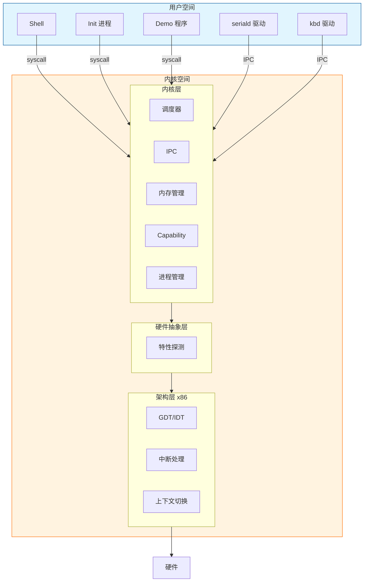
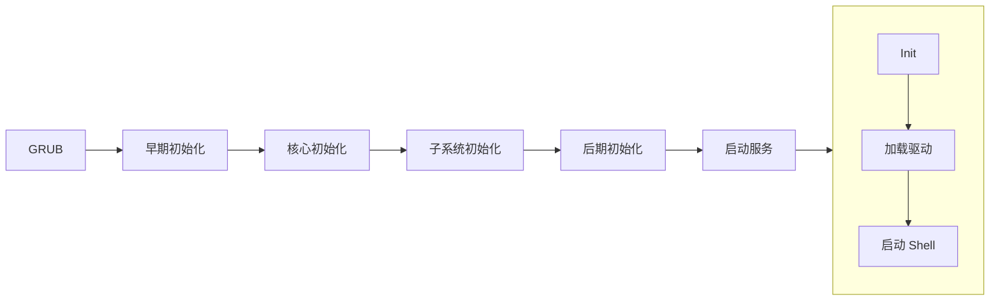
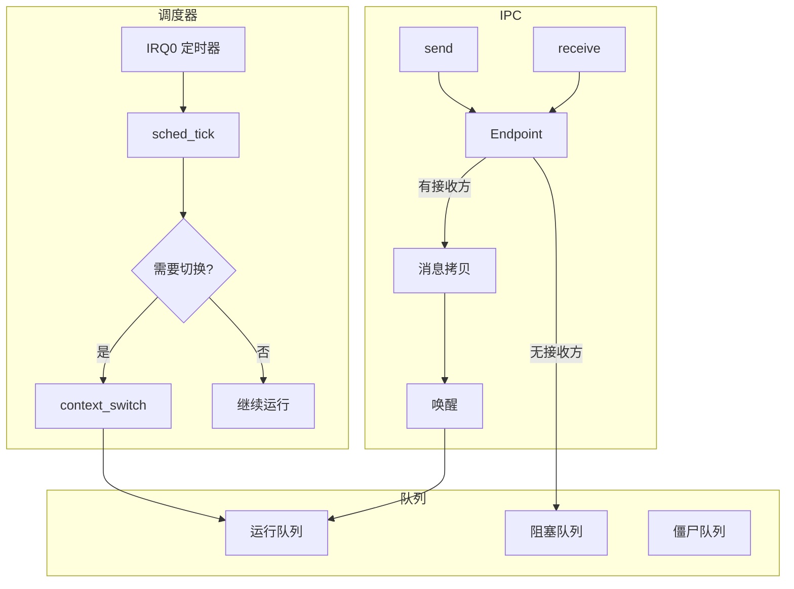

# Xnix

一个用于学习操作系统原理的 x86 微内核操作系统。


## 简介

Xnix 是一个从零构建的 32 位 x86 操作系统内核，采用微内核架构设计。项目源于作者在完成
MyRTOS-Demo（[GitHub](https://github.com/SH-XiaoXiu/MyRTOS-Demo) / [Gitee](https://gitee.com/sh-xiaoxiu/my-rtos-demo)
）（ARM32 RTOS）后，希望进一步探索更复杂的系统设计。

**技术栈**：C11 + x86 Assembly + CMake + GCC + QEMU

## 核心能力

| 能力                | 说明                  | 示例                      |
|-------------------|---------------------|-------------------------|
| 微内核设计             | 最小化内核，策略与机制分离       | 内核仅含调度、IPC、内存管理         |
| 平台抽象              | HAL + 弱符号机制，支持多平台移植 | 新增架构只需实现少量强符号           |
| 能力系统 (Capability) | 细粒度权限控制，无全局特权       | I/O 端口访问需持有对应 cap       |
| IPC 通信            | 同步/异步消息传递，支持 RPC 模式 | endpoint send/recv/call |
| 用户态驱动 (UDM)       | 驱动隔离，崩溃可恢复，支持热更新    | seriald、kbd 均为用户进程      |
| 进程管理              | 完整生命周期、信号机制、进程树     | fork-like spawn、SIGTERM |

## 项目亮点

- **平台无关设计**：内核核心逻辑与硬件分离，通过 HAL 抽象层适配不同平台
- **弱符号机制**：使用 `__attribute__((weak))` 实现优雅的平台适配
- **Opaque 类型**：公共 API 隐藏内部实现，保证接口稳定性
- **驱动隔离**：UDM 模式下驱动崩溃可自动恢复，不拖垮系统

## 快速开始

### 1. 环境准备

**Windows 用户**

需要先安装 WSL2，参考 [微软官方文档](https://learn.microsoft.com/zh-cn/windows/wsl/install)，然后在 WSL 中按 Linux
方式安装工具链。

**Linux 用户 (Ubuntu/Debian)**

```bash
sudo apt install gcc gcc-multilib grub-pc-bin xorriso qemu-system-x86 make cmake
```

### 2. 构建并运行

```bash
git clone https://github.com/user/xnix.git
cd xnix
./run -f    # 清理 + 编译 + 运行
```


### 3. 体验 Shell

系统启动后会进入交互式 shell，可以尝试：

```
> help           # 查看可用命令
> ps             # 查看进程列表
> demo hello     # 运行 demo 程序
> kill <pid>     # 终止进程
```


## 运行环境

| 项目   | 要求                            |
|------|-------------------------------|
| 操作系统 | Linux（推荐 Ubuntu 20.04+）或 WSL2 |
| 编译器  | GCC 支持 32 位编译（gcc-multilib）   |
| 模拟器  | QEMU x86                      |
| 构建工具 | CMake 3.10+, Make             |

## 配置选项

通过 CMake 变量控制编译选项：

```bash
./run -DENABLE_SMP=ON -DCFG_MAX_CPUS=4    # 启用多核支持
./run -DCFG_DEBUG_SCHED=ON                 # 调度器调试输出
./run -DENABLE_VMM_DEBUG=ON                # 内存管理调试
```

QEMU 硬件配置：

```bash
./run -f --mem 256M --smp 2    # 指定内存和 CPU 核心数
```

## 使用方式

### 常用命令

```bash
./run -f                 # 完整构建并运行
./run                    # 增量编译运行
./run -d                 # 调试模式（GDB :1234）
./run -c                 # 只编译不运行
./run --clean            # 清理构建产物
./run --rebuild          # 完全重建
```

### 调试

```bash
# 终端 1: 启动调试模式
./run -d

# 终端 2: 连接 GDB
gdb build/xnix.elf -ex "target remote :1234"
```

## 项目结构

```
xnix/
├── main/                   # 内核代码
│   ├── arch/x86/           # x86 架构实现
│   │   ├── boot/           # 启动代码、链接脚本
│   │   ├── cpu/            # GDT、IDT、上下文切换
│   │   └── hal/            # 硬件特性探测
│   ├── kernel/             # 内核子系统（平台无关）
│   │   ├── sched/          # 调度器
│   │   ├── ipc/            # IPC 机制
│   │   ├── mm/             # 内存管理
│   │   ├── process/        # 进程管理
│   │   └── cap/            # Capability 系统
│   ├── lib/                # 内核库（同步原语等）
│   ├── drivers/            # 内核态控制台（早期输出）
│   └── include/            # 公共头文件
│
├── user/                   # 用户态代码
│   ├── init/               # init 进程
│   ├── apps/shell/         # 交互式 shell
│   ├── drivers/            # UDM 驱动（seriald, kbd）
│   ├── demos/              # 示例程序
│   └── libs/               # 用户态库
│
├── run                     # 构建运行脚本
└── CMakeLists.txt
```

## 系统架构

### 整体架构



### 启动流程



### 调度与 IPC



## 扩展开发

### 添加新驱动

1. 在 `user/drivers/` 下创建目录
2. 实现驱动主循环（接收 IPC 请求、处理、回复）
3. 在 `user/init/main.c` 中添加启动代码
4. 更新 CMakeLists.txt

```c
// 驱动基本结构
int main(void) {
    // 初始化
    while (1) {
        ipc_msg_t msg;
        ipc_receive(ep, &msg);  // 等待请求
        // 处理请求
        ipc_reply(ep, &reply);  // 回复
    }
}
```

### 添加系统调用

1. 在 `main/include/xnix/syscall_nr.h` 添加调用号
2. 在 `main/kernel/sys/syscall.c` 添加处理函数
3. 在 `user/libs/` 添加用户态封装

### 添加 Shell 命令

修改 `user/apps/shell/main.c`，在命令表中添加新命令。

## 部署

Xnix 是一个教学项目，主要在 QEMU 中运行。如需在真实硬件上测试：

```bash
./run -f -i              # 生成 ISO
# 将 build/xnix.iso 写入 U 盘或用于虚拟机启动
```

<!-- 截图：PVE 虚拟机运行演示 -->


> 注意：真实硬件运行未经充分测试，QEMU可能与真实硬件行为不一致。

## 常见问题

**Q: 编译报错找不到 32 位库？**

安装 multilib 支持：

```bash
sudo apt install gcc-multilib
```

**Q: QEMU 启动后黑屏？**

检查 GRUB 配置，确保 `grub-pc-bin` 和 `xorriso` 已安装。

**Q: 如何查看串口输出？**

```bash
./run --qemu "-serial file:serial.log"
cat serial.log
```

## 参考资料

- [《深入理解计算机系统》](https://book.douban.com/subject/26912767/)
- [《Linux内核设计与实现》](https://book.douban.com/subject/37875969/)
- [《x86汇编:从实模式到保护模式》](https://book.douban.com/subject/20492528/)
- [OSDev Wiki](https://wiki.osdev.org/)
- [Intel SDM](https://www.intel.com/sdm)
- [L4 微内核](https://www.l4hq.org/)
- [YatSenOS 教程](https://ysos.gzti.me/)

## License

MIT License

## 作者

[XiaoXiu](https://www.xiuxius.cn)
