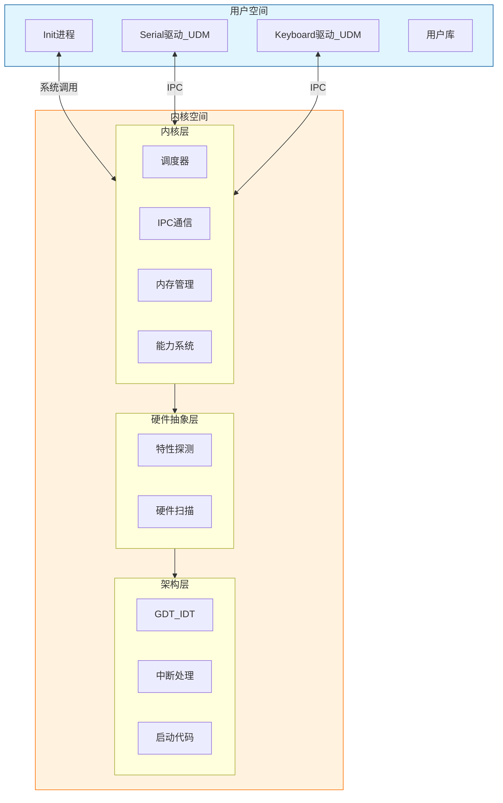
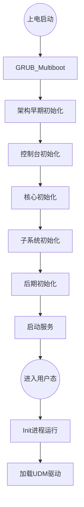
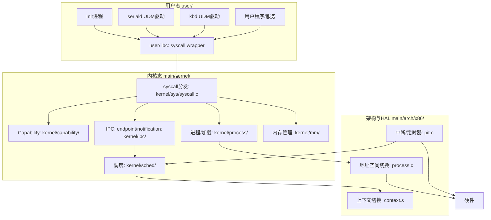
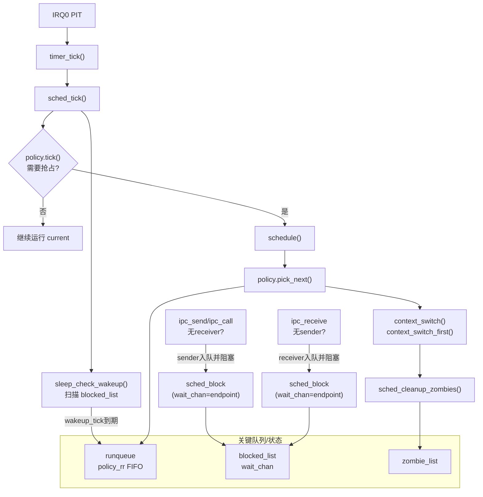
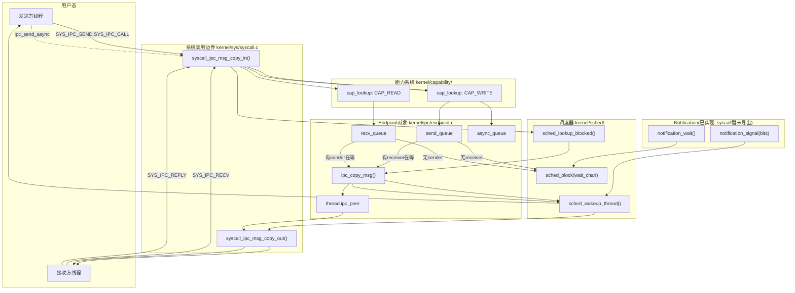

# Xnix

Xnix 是一个 x86 32 位操作系统内核项目，旨在学习和实践现代操作系统开发。项目以 x86 架构为示例开发，但核心设计致力于实现平台无关性。

本项目在完成 [MyRTOS-Demo](https://github.com/SH-XiaoXiu/MyRTOS-Demo)（基于 ARM32 的 RTOS）后启动，旨在进一步探索微内核架构与更复杂的系统设计。

## 设计思路

### 微内核架构

Xnix 采用微内核设计，内核只保留最基本的功能（调度、IPC、内存管理、能力系统）

* **UDM (User Driver Model)**：驱动程序（如串口、键盘）运行在用户态，通过 IPC 与内核交互。
* **高可靠性**：驱动崩溃不会导致内核崩溃。

### 平台无关性

系统采用三层分离设计，确保内核核心逻辑不依赖具体硬件：

* **Arch (架构层)**：处理 CPU 架构强相关的逻辑（如 GDT/IDT、上下文切换）。
* **HAL (硬件抽象层)**：探测硬件特性，屏蔽底层差异。
* **Kernel (内核层)**：纯逻辑实现，不包含汇编或特定硬件指令。

### 抽象与封装

* **弱符号： `__attribute__((weak))` 提供默认实现，特定平台可按需覆盖，简化跨平台移植。
* **Opaque Types**：公共 API 使用不透明指针（就是句柄）（如 `thread_t`），隐藏内核内部数据结构细节，保证 API 稳定性。

## 工程结构

```text
main/
├── arch/x86/               # x86 架构实现（GDT, IDT, 启动代码）
├── include/                # 公共头文件
│   ├── arch/               # 架构抽象接口
│   ├── drivers/            # 内核态驱动接口
│   └── xnix/               # 系统公共 API
├── kernel/                 # 内核子系统（平台无关）
│   ├── ipc/                # IPC 机制
│   ├── cap/                # Capability 能力系统
│   ├── mm/                 # 内存管理
│   ├── process/            # 进程管理
│   └── sched/              # 调度器
├── lib/                    # 内核通用库（同步原语等）
└── drivers/                # 内核态控制台框架（早期输出）

user/                       # 用户态代码
├── drivers/                # UDM 驱动（seriald, kbd 等）
├── init/                   # init 进程
└── lib/                    # 用户态库（Syscall 封装）
```

## 系统架构

### 整体架构图



### 启动流程图



### 架构设计图



### 调度图



### IPC图（Endpoint/RPC/异步/Notification + Capability）



## 如何运行

### 环境依赖
```bash
# 安装构建工具和 QEMU
sudo apt install gcc gcc-multilib grub-pc-bin xorriso qemu-system-x86 make cmake
```

### 快速开始

`run` 脚本

```bash

./run -f                 # 清理 + 并行编译 + 运行

./run                    # 增量编译并运行

# 查看所有选项
./run --help
```

### 常用示例

```bash
./run -f                 # 构建运行
./run                    # 增量编译运行
./run -f -i              # 构建 + ISO 完整测试
./run -d                 # 调试模式（等待 GDB :1234）

# 清理操作
./run --clean            # 只清理不编译
./run --clean-all        # 完全删除 build
./run --rebuild          # 完全重建（删除 build + 重新配置）

# QEMU 硬件配置
./run -f --mem 256M --smp 2    # 指定内存和 CPU 核心
./run -f --mem 512M --smp 4    # 更大配置

# CMake 编译配置
./run -DENABLE_SMP=ON -DCFG_MAX_CPUS=8     # 启用 SMP
./run -DCFG_DEBUG_SCHED=ON                 # 调度器调试
./run -DENABLE_VMM_DEBUG=ON                # VMM 调试

# 额外功能
./run -c                       # 只编译不运行
./run -i                       # 使用 ISO 启动
./run --qemu "-serial file:serial.log"    # 串口输出到文件
```

### 调试流程

```bash
# 终端 1: 启动调试模式
./run -d

# 终端 2: 连接 GDB
gdb build/xnix.elf -ex "target remote :1234"
```

### Make 方式

```bash
# 初始化
mkdir build && cd build
cmake ..

# 并行编译运行
make -j$(nproc) iso
make run

# 调试
make debug
```

## 用户代码

所有用户态代码位于 `user/` 目录下：

* **驱动开发**：在 `user/drivers/` 下创建新的驱动。建议使用 UDM 模式，驱动即进程，通过 IPC 提供服务。
* **应用程序**：在 `user/init/` 或新建目录开发应用。
* **系统调用**：用户态通过 `user/lib/` 提供的库函数发起系统调用。

## 资料来源

* 《Linux内核设计与实现》(Linux Kernel Development)
* https://ysos.gzti.me/
* https://www.intel.com/sdm
* https://wiki.osdev.org/Spinlock
* https://www.l4hq.org/
* https://www.bilibili.com/video/BV1TTUfBYEEA/

## 其他

* **作者**: XiaoXiu
* **License**: MIT License
