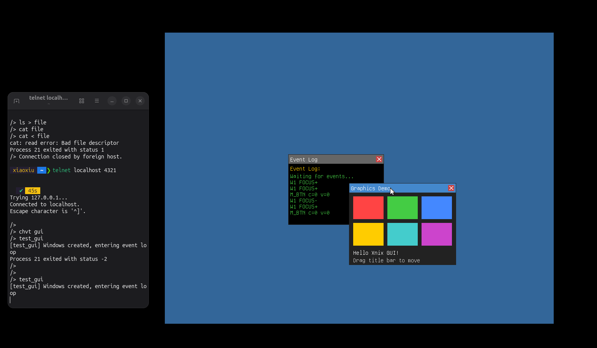
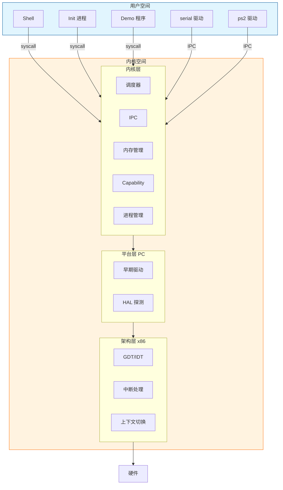
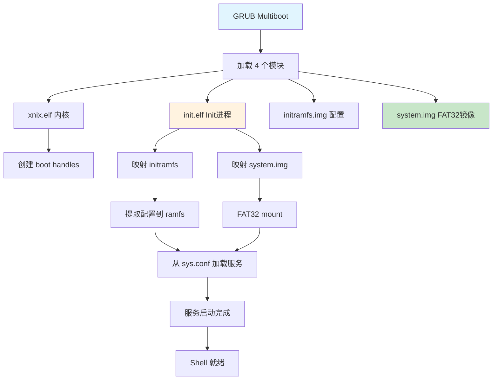
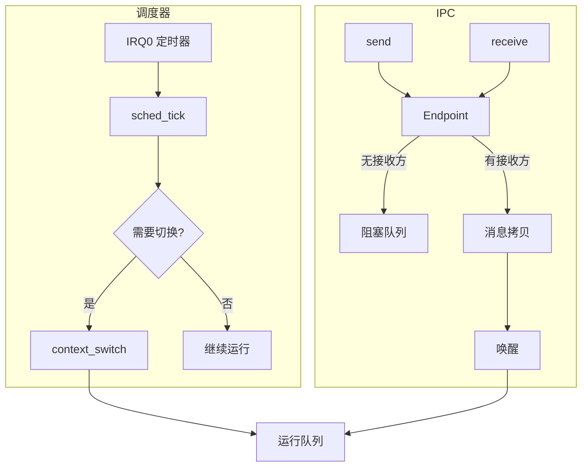

# Xnix

一个用于学习操作系统原理的 x86 微内核操作系统。



## 简介

Xnix 是一个从零构建的 32 位 x86 操作系统内核，采用微内核架构设计。项目源于作者在完成
MyRTOS-Demo（[GitHub](https://github.com/SH-XiaoXiu/MyRTOS-Demo) / [Gitee](https://gitee.com/sh-xiaoxiu/my-rtos-demo)
）（ARM32 RTOS）后，希望进一步探索更复杂的系统设计。

**技术栈**：C11 + x86 Assembly + CMake + GCC + QEMU

已经具备：

- `init` 自举
- 用户态服务管理
- 用户态驱动
- `vfs + fatfs + devfs`
- 多串口终端
- VGA 多虚拟终端
- `console` 前台会话管理
- `ws` GUI session
- `/dev/ttyN`
- GUI 进程退出自动回收窗口


## 核心能力

| 能力           | 说明                         | 示例                         |
|--------------|----------------------------|----------------------------|
| 微内核设计        | 最小化内核，策略与机制分离              | 内核仅含调度、IPC、内存管理            |
| Bootstrap 自举 | Init 完全自举，内核不依赖 bootloader | 内置 FAT32 驱动，绕过 VFS 启动服务    |
| 平台抽象         | HAL + 弱符号机制，支持多平台移植        | 新增架构只需实现少量强符号              |
| 权限系统         | Capability bitmap，内核强制检查    | `CAP_IO_PORT`、`CAP_IRQ` 等   |
| IPC 通信       | 同步 rendezvous，支持 RPC 模式     | endpoint send/recv/call    |
| 用户态驱动        | 驱动隔离，崩溃可恢复，支持热更新           | serial、ps2 均为用户进程          |
| 进程管理         | 完整生命周期、进程树、process watch   | exec-based spawn           |
| FAT32 文件系统   | 支持读写 FAT32 格式磁盘            | 可挂载硬盘镜像进行文件操作              |
| 声明式服务管理      | INI 配置、依赖管理、自动重启           | sys.conf 定义启动顺序            |
| GUI 会话       | ws 窗口系统，VT/GUI 切换          | `chvt gui`、`test_gui`      |

## 核心设计原则

### 1. 微内核分层

明确按微内核方式组织：

- 内核只提供机制
  - 调度
  - IPC
  - 内存管理
  - 进程/线程生命周期
  - IRQ
  - handle / capability / process watch
- 策略在用户态
  - 服务编排
  - 文件系统
  - 终端
  - console/session 管理
  - 图形系统
  - 驱动

### 2. 统一对象语义

- IPC `send` / `call` 语义分离
- VFS 路径层与对象层分离
- 普通目录直连后端对象
- TTY 主路径统一到：
  - `IO_READ`
  - `IO_WRITE`
  - `IO_CLOSE`
  - `IO_IOCTL`
- `console` 独立承担前台 session 管理
- `BOOT -> TTY -> GUI` 会话模型已建立

### 3. 用户态驱动与服务优先

大部分设备逻辑都在用户态：

- 串口驱动：`serial`
- PS/2 输入驱动：`ps2`
- 显示驱动：`display`
- FAT 文件系统驱动：`fatfs`
- 终端服务：`term`
- 会话管理：`console`
- 窗口系统：`ws`

## 当前状态

### 已完成的主链

- `init` 自举
- `ramfsd` + `initramfs` 解包
- `sys.conf` 声明式服务配置
- `vfs` 路径层
- `fatfs` 根文件系统
- `devfs`
- `term`
- `console`
- `ws`
- `/dev/tty0..tty6`
- 多串口 shell
- VGA 多 VT
- GUI session 切换
- GUI 进程退出自动回收
- `process watch`

### 已验证能力

- `ls /`、`ls /bin`、`cat`、`write`
- 当前工作目录与路径解析
- 多串口终端并行工作
- 共享 IRQ 串口分发
- `/dev/tty0..tty6`
- `ttysend /dev/ttyN "cmd\n"`
- VGA 多 VT：`chvt 0`、`chvt 5`、`chvt 6`
- `chvt gui`、`test_gui`
- GUI 进程退出后窗口自动回收
- `run ls`、`run test_args a b c`、`run test_gui`

### 未完成的部分

当前系统已经具备一条可工作的用户态主链，但还没有把 POSIX 语义做完整。

- `fork`
- 真正的 `execve / execv / execvp`
- 更完整的 shell 文件重定向/复杂 fd 语义
- `termios`
- `poll / select`
- `fcntl`
- 更完整的 PATH / 环境变量语义

## 系统架构

### 整体架构


```mermaid
graph TD
    subgraph UserSpace["用户空间"]
        Shell[Shell]
        Init[Init 进程]
        SerialD[serial 驱动]
        PS2[ps2 驱动]
        Demo[Demo 程序]
    end

    subgraph KernelSpace["内核空间"]
        subgraph Kernel["内核层"]
            Sched[调度器]
            IPC[IPC]
            MM[内存管理]
            Cap[Capability]
            Proc[进程管理]
        end

        subgraph Platform["平台层 PC"]
            EarlyDrv[早期驱动]
            HAL[HAL 探测]
        end

        subgraph Arch["架构层 x86"]
            GDT[GDT/IDT]
            IRQ[中断处理]
            Ctx[上下文切换]
        end
    end

    Hardware[硬件]

    Shell & Init & Demo -->|syscall| Kernel
    SerialD & PS2 -->|IPC| Kernel
    Kernel --> Platform --> Arch --> Hardware

    style UserSpace fill:#e1f5fe,stroke:#01579b
    style KernelSpace fill:#fff3e0,stroke:#ff6f00
```

### 启动流程


```mermaid
graph TD
    GRUB[GRUB Multiboot] --> Modules[加载 4 个模块]
    Modules --> Kernel[xnix.elf 内核]
    Modules --> Init[init.elf Init进程]
    Modules --> Initramfs[initramfs.img 配置]
    Modules --> System[system.img FAT32镜像]

    Kernel --> BootHandles[创建 boot handles]

    Init --> Map1[映射 initramfs]
    Map1 --> Extract[提取配置到 ramfs]

    Init --> Map2[映射 system.img]
    Map2 --> FAT32[FAT32 mount]

    Extract --> LoadSvc[从 sys.conf 加载服务]
    FAT32 --> LoadSvc
    LoadSvc --> Services[服务启动完成]
    Services --> Shell[Shell 就绪]

    style GRUB fill:#e1f5fe
    style Init fill:#fff3e0
    style System fill:#c8e6c9
```

### 调度与 IPC


```mermaid
graph TD
    subgraph Scheduler["调度器"]
        IRQ0[IRQ0 定时器] --> Tick[sched_tick]
        Tick --> Check{需要切换?}
        Check -->|是| Switch[context_switch]
        Check -->|否| Continue[继续运行]
    end

    subgraph IPC["IPC"]
        Send[send] --> EP[Endpoint]
        Recv[receive] --> EP
        EP -->|无接收方| BlockQ[阻塞队列]
        EP -->|有接收方| Copy[消息拷贝] --> Wake[唤醒]
    end

    Switch --> RunQ[运行队列]
    Wake --> RunQ
```

## 快速开始

### 1. 环境准备

**Windows 用户**

需要先安装 WSL2，参考 [微软官方文档](https://learn.microsoft.com/zh-cn/windows/wsl/install)，然后在 WSL 中按 Linux
方式安装工具链。

**Linux 用户 (Ubuntu/Debian)**

```bash
sudo apt install gcc gcc-multilib grub-pc-bin xorriso qemu-system-x86 make cmake mtools dosfstools
```

如果你要用项目自带的格式与静态分析配置，建议额外安装：

```bash
sudo apt install clang-format clang-tidy
```

### 2. 构建并运行

```bash
git clone https://gitee.com/sh-xiaoxiu/xnix.git
cd xnix
./run -b       # 清理重建 + 运行（默认 ISO 模式）
```


### 3. 体验 Shell

系统启动后会进入交互式 shell，可以尝试：

```
/> help          # 查看可用命令
/> ps            # 查看进程列表
/> ls /bin       # 查看应用列表
/> run test_gui  # 运行 GUI 程序
/> chvt gui      # 切换到 GUI 会话
/> chvt 0        # 切回 VGA 终端
```


## 运行环境

| 项目   | 要求                            |
|------|-------------------------------|
| 操作系统 | Linux（推荐 Ubuntu 20.04+）或 WSL2 |
| 编译器  | GCC 支持 32 位编译（gcc-multilib）   |
| 模拟器  | QEMU x86                      |
| 构建工具 | CMake 3.10+, Make             |

## Bootstrap 启动

Xnix 实现了微内核自举架构，内核不依赖 bootloader 细节：

| 组件       | 职责                | 不知道什么             |
|----------|-------------------|-------------------|
| **内核**   | 提供机制（进程创建、IPC、内存） | 不知道 GRUB、不知道文件系统  |
| **Init** | 策略实现（服务启动、配置管理）   | 完全自举，不依赖外部服务      |
| **服务**   | 功能实现（VFS、驱动等）     | 从 system.img 按需加载 |

### 启动路径

1. GRUB 加载 `xnix.elf`、`init.elf`、`initramfs.img`、`system.img`
2. 内核创建 boot handles
3. 启动 `init`
4. `init` 启动内置 `ramfsd`
5. 解包 `initramfs`
6. 读取 `/etc/sys.conf`
7. 启动核心驱动与服务
8. 迁移到 `vfs`
9. `fatfs` 接管根目录
10. `term` 建立 `tty0..tty6`
11. `console` 建立前台 session
12. `BOOT -> tty0` handoff
13. 启动 shell / ws / 其他服务

## 前台会话模型

当前前台 session 类型由 `console` 统一管理：

- `BOOT`
- `TTY`
- `GUI`

这意味着：

- `chvt 0/5/6` 切的是 VGA TTY session
- `chvt gui` 切的是 GUI session
- 串口 `tty1..tty4` 本身是独立终端，不属于 VGA 前台切换对象

## 多串口与终端模型

串口与终端映射：

- `COM1 -> tty1`
- `COM2 -> tty2`
- `COM3 -> tty3`
- `COM4 -> tty4`

VGA 侧当前使用：`tty0`、`tty5`、`tty6`

## 运行时目录

- `/bin`：普通应用与工具
- `/sbin`：系统服务
- `/sbin/driver`：驱动
- `/etc`：配置
- `/dev`：设备节点
- `/boot`：启动资源

## 当前核心组件

### 服务

- `/sbin/vfs.elf`
- `/sbin/devfs.elf`
- `/sbin/term.elf`
- `/sbin/console.elf`
- `/sbin/syslog.elf`
- `/sbin/klog.elf`
- `/sbin/ws.elf`

### 驱动

- `/sbin/driver/serial.elf`
- `/sbin/driver/ps2.elf`
- `/sbin/driver/display.elf`
- `/sbin/driver/fatfs.elf`
- `/sbin/driver/fb.elf`

### 常用应用

- `/bin/shell.elf`
- `/bin/ls.elf`
- `/bin/cat.elf`
- `/bin/write.elf`
- `/bin/chvt.elf`
- `/bin/ttysend.elf`
- `/bin/test_gui.elf`

## 用户态库

- `libsys`：低层机制接口（syscall wrapper、ABI helper、IPC helper、server helper）
- `libc`：基础运行时（stdio、malloc、string、errno、fd/VFS/IO 封装、dup、dup2、pipe）
- `libpthread`：线程、互斥、join/detach
- `libposix`：高层 POSIX 风格接口（posix_spawn、posix_spawnp、waitpid、wait）
- `libdriver`：驱动框架（chardev、inputdev、displaydev）
- `libws`：GUI 客户端库，用于与 `ws` 协作
- `libfont`：字体与简单绘制辅助
- `libblock`：块设备/文件系统相关辅助
- `libproc`：init/bootstrap 与显式 handle 图构造（普通应用最终应依赖 `libposix`）

## 当前 POSIX 状态

已具备：

- `dup`、`dup2`、`pipe`
- `posix_spawn`、`posix_spawnp`
- `waitpid`、`wait`

尚未完成：

- `fork`
- `execve`、`execv`、`execvp`

### 关于 `fork`

未来会支持 POSIX 风格的 `fork`，但在这套微内核里，更合理的路线是：

- 内核提供底层机制（地址空间复制或 COW、线程/进程创建、handle 表复制、生命周期一致性）
- `libposix` 组合出 `fork()` 语义

## 构建与运行

### 常用命令

```bash
./run                    # 增量编译 + 运行
./run -b                 # 清理重建 + 运行
./run -i                 # ISO 模式运行
./run -b -i              # 清理重建 + ISO 模式
./run -n -b -i           # 只编译 ISO（不运行）
./run -d -i              # ISO 调试模式（GDB :1234）
./run --install src.img --hda dst.img  # 复制磁盘镜像后运行
```

### 配置选项

通过 CMake 变量控制编译选项：

```bash
cd build
cmake .. -DENABLE_SMP=ON -DCFG_MAX_CPUS=4    # 启用多核支持
cmake .. -DCFG_DEBUG=ON                       # 启用调试输出
```

QEMU 硬件配置：

```bash
./run -i --qemu "-m 256M -smp 4"    # 指定内存和 CPU 核心数
```

### 多串口验证

```bash
./run -i -b \
  --serial telnet:4321 \
  --extra-serial telnet:4322 \
  --extra-serial telnet:4323 \
  --extra-serial telnet:4324
```

### 调试

```bash
# 终端 1: 启动调试模式
./run -d -i

# 终端 2: 连接 GDB
gdb build/xnix.elf -ex "target remote :1234"
```

在代码中使用 `ulog` 输出（通过串口）：

```c
#include <xnix/ulog.h>
ulog_info("mydrv", "Initialized, handle=%d", ep);
```

## 项目结构

目录组织围绕**机制 / ABI / 策略**三条线：

```
xnix/
│
├── main/
│   ├── arch/x86/               # 架构支撑（不称"驱动"）
│   │   ├── boot/               # 启动代码、链接脚本
│   │   ├── core/               # GDT/IDT、MMU、上下文切换
│   │   └── platform/           # PC 平台早期输出（PIC/PIT/串口/VGA）
│   └── kernel/                 # 内核子系统（平台无关）
│       ├── sched/              # 调度器
│       ├── ipc/                # IPC（同步 rendezvous）
│       ├── mm/                 # 内存管理
│       ├── process/ exec/      # 进程生命周期、ELF 加载
│       ├── handle/             # Handle 表
│       ├── irq/                # 中断管理
│       └── sys/                # 系统调用分发
│
│  ── ABI 层
│
├── sdk/include/xnix/
│   ├── abi/                    # syscall 号、IPC opcode、handle、cap、errno、IO 协议
│   ├── driver/                 # ioport/irq 辅助（用户态驱动使用）
│   └── protocol/               # 服务间协议定义
│
└── user/
    ├── init/                   # 自举 + 声明式服务管理
    │   ├── bootstrap/          # FAT32 reader、exec wrapper
    │   └── svc/                # sys.conf 解析、依赖调度、handle 注入
    │
    ├── drivers/                # 用户态驱动（崩溃可恢复）
    │   ├── seriald/            # 串口驱动
    │   ├── ps2d/  kbd/         # PS/2 输入、键盘解码
    │   ├── fatfsd/             # FAT32 文件系统驱动
    │   ├── displayd/ fbd/ vgad/  # 显示驱动链
    │   └── moused/ fbcond/     # 鼠标、framebuffer console
    │
    ├── servers/                # 系统服务（实现设备与文件系统语义）
    │   ├── vfsserver/          # VFS 路径层
    │   ├── devfsd/             # /dev 设备节点
    │   ├── termd/ ttyd/        # 终端（tty0..tty6）
    │   ├── consoled/           # 前台 session 管理（BOOT/TTY/GUI）
    │   ├── wsd/                # 窗口系统
    │   └── syslogd/ klogd/     # 日志服务
    │
    ├── apps/                   # 应用（只看到 POSIX 接口）
    │   ├── shell/              # 交互式 shell
    │   ├── bin/                # ls、cat、ps、chvt、ttysend、dmesg …
    │   └── test_gui/           # GUI 测试程序
    │
    └── libs/                   # 用户态库
        ├── libsys/             # syscall wrapper、IPC helper
        ├── libc/               # stdio、malloc、string、fd/IO 封装
        ├── libposix/           # posix_spawn、waitpid …
        ├── libpthread/         # 线程、互斥
        ├── libdriver/          # 驱动框架（chardev、inputdev、displaydev）
        └── libws/              # GUI 客户端库
```

## 服务配置

系统配置统一在 `user/sys.conf`，采用声明式服务管理，描述：

- handle 定义
- 服务声明与依赖关系（`after`、`ready`、`requires`、`provides`）
- `stdio`、`respawn`

### ISO 结构

```
xnix.iso
├── boot/
│   ├── xnix.elf         # 内核
│   ├── init.elf         # Init 进程（内置 ramfsd + bootstrap）
│   ├── initramfs.img    # TAR 格式配置文件（~5KB）
│   └── system.img       # FAT32 镜像（所有服务，16MB）
└── ...
```

### system.img 内容

```
system.img (FAT32):
├── sbin/                # 核心服务与驱动
│   ├── driver/
│   │   ├── serial.elf
│   │   ├── ps2.elf
│   │   └── ...
│   ├── vfs.elf
│   ├── term.elf
│   └── ...
├── bin/                 # 应用程序
│   └── shell.elf
└── etc/                 # 配置文件
    └── sys.conf
```

### 服务配置示例

```ini
[handle.vfs_ep]
type = endpoint

[service.serial]
type = path
path = /sbin/driver/serial.elf
after = ramfsd
provides = serial
respawn = false

[service.vfs]
type = path
path = /sbin/vfs.elf
after = serial
requires = serial
provides = vfs_ep
ready = vfs_ep

[service.shell]
type = path
path = /bin/shell.elf
after = term console
requires = vfs_ep tty0
stdio = tty0
```

### 配置字段

| 字段         | 类型     | 说明                                            |
|------------|--------|-----------------------------------------------|
| `type`     | string | `path`=从 system.img 加载 ELF                   |
| `path`     | string | ELF 文件路径（相对 system.img 根目录）                  |
| `after`    | string | 启动顺序依赖，空格分隔多个服务                               |
| `ready`    | string | 就绪等待依赖，等待服务报告就绪                               |
| `provides` | string | 提供的 handle 名称                                 |
| `requires` | string | 需要的 handle，空格分隔                               |
| `stdio`    | string | 标准 IO 绑定的 tty handle                          |
| `respawn`  | bool   | 退出后自动重启                                       |

### Handle 机制

服务通过 `provides` 和 `requires` 声明 handle 依赖，init 负责在启动时注入：

```c
handle_t vfs = sys_handle_find("vfs_ep");
sys_ipc_call(vfs, &req, &reply, timeout);
```

## 如何基于 Xnix 开发

### 添加驱动/服务

在 `user/drivers/` 或 `user/servers/` 创建目录：

```
user/drivers/mydrv/
├── src/main.c
└── CMakeLists.txt
```

```cmake
add_executable(mydrv.elf src/main.c)
target_link_libraries(mydrv.elf PRIVATE sys c driver)
target_link_options(mydrv.elf PRIVATE ${USER_LINK_OPTIONS})
```

在 `user/sys.conf` 中声明：

```ini
[service.mydrv]
type = path
path = /sbin/driver/mydrv.elf
after = serial
provides = mydrv_ep
```

### 添加应用程序

```
user/apps/myapp/
├── main.c
└── CMakeLists.txt
```

```cmake
add_executable(myapp.elf main.c)
target_link_libraries(myapp.elf PRIVATE c posix)
target_link_options(myapp.elf PRIVATE ${USER_LINK_OPTIONS})
```

应用会自动打包到 `system.img:/bin/myapp.elf`。

### 头文件包含规范

| 路径前缀                | 可见性   | 说明                          |
|---------------------|-------|-------------------------------|
| `<xnix/abi/xxx>`    | 公共ABI | 用户态/内核共享接口（syscall、IPC、handle） |
| `<xnix/driver/xxx>` | 公共SDK | 驱动辅助工具（ioport、irq）           |
| `<xnix/xxx>`        | 内核内部  | 仅内核可用                        |
| `<plat/xxx>`        | 平台接口  | 仅内核平台层可用                     |
| `<arch/xxx>`        | 架构接口  | 仅内核架构层可用                     |

用户态代码只能包含 `sdk/include/xnix/abi/`、`sdk/include/xnix/driver/`，以及 `user/libs/` 下的头文件。

### 添加系统调用

1. 定义调用号（`sdk/include/xnix/abi/syscall.h`）：

```c
#define SYS_MYNEWCALL 700
```

2. 实现内核处理（`main/kernel/sys/sys_xxx.c`）：

```c
static int32_t sys_mynewcall(const uint32_t *args) {
    return 0;
}

void sys_xxx_init(void) {
    syscall_register(SYS_MYNEWCALL, sys_mynewcall, 1, "mynewcall");
}
```

3. 用户态封装（`user/libs/libsys/`）：

```c
static inline int sys_mynewcall(int arg) {
    return syscall1(SYS_MYNEWCALL, arg);
}
```

## 磁盘镜像与 FAT32

### 在 Linux/WSL 中挂载

```bash
sudo mkdir -p /mnt/xnix_disk
sudo mount -o loop build/disk.img /mnt/xnix_disk
sudo cp myfile.txt /mnt/xnix_disk/
sudo umount /mnt/xnix_disk
```

### 在 Windows 中使用 ImDisk 挂载

```powershell
# 安装
winget install ImDisk.Toolkit

# 挂载到 X: 盘
imdisk -a -f "C:\path\to\xnix\build\disk.img" -m X:

# 卸载
imdisk -d -m X:
```

> 挂载前确保 QEMU 未使用该镜像，修改完成后务必先卸载再启动 QEMU。

## 部署

Xnix 是一个教学项目，主要在 QEMU 中运行。如需在真实硬件上测试：

```bash
./run -n -b -i    # 生成 ISO
# 将 build/xnix.iso 写入 U 盘或用于虚拟机启动
```


> 注意：真实硬件运行未经充分测试，QEMU 可能与真实硬件行为不一致。

## 当前继续推进的方向

1. `libposix` 继续扩展
2. `libproc` 逐步移除
3. `fork` 所需的底层机制设计
4. 真正的 `exec*` 支持
5. 更完整的 PATH / 环境变量语义
6. `termios`
7. `poll / select`
8. `fcntl`
9. shell 文件重定向和更完整 fd 语义的正式对象模型

## 常见问题

**Q: CMake 版本过低（项目要求 3.20+，Ubuntu 20.04 自带 3.16）？**

从 [github.com/Kitware/CMake/releases](https://github.com/Kitware/CMake/releases) 下载免安装的自解压脚本：

```bash
wget https://github.com/Kitware/CMake/releases/download/v3.31.7/cmake-3.31.7-linux-x86_64.sh
chmod +x cmake-3.31.7-linux-x86_64.sh
./cmake-3.31.7-linux-x86_64.sh --prefix=$HOME/.local --skip-license
```

然后把 `$HOME/.local/bin` 加到 PATH（写入 `~/.bashrc` 或 `~/.zshrc`）：

```bash
export PATH="$HOME/.local/bin:$PATH"
```

**Q: 编译报错找不到 32 位库？**

```bash
sudo apt install gcc-multilib
```

**Q: QEMU 启动后黑屏？**

检查 GRUB 配置，确保 `grub-pc-bin` 和 `xorriso` 已安装。

**Q: 如何查看串口输出？**

```bash
./run --qemu "-serial file:serial.log"
cat serial.log
```

## 参考资料

- [《深入理解计算机系统》](https://book.douban.com/subject/26912767/)
- [《Linux内核设计与实现》](https://book.douban.com/subject/37875969/)
- [《x86汇编:从实模式到保护模式》](https://book.douban.com/subject/20492528/)
- [OSDev Wiki](https://wiki.osdev.org/)
- [Intel SDM](https://www.intel.com/sdm)
- [YatSenOS 教程](https://ysos.gzti.me/)
- [ChatGPT](https://chatgpt.com/)

## License

MIT License

## 作者

[XiaoXiu](https://www.xiuxius.cn)
